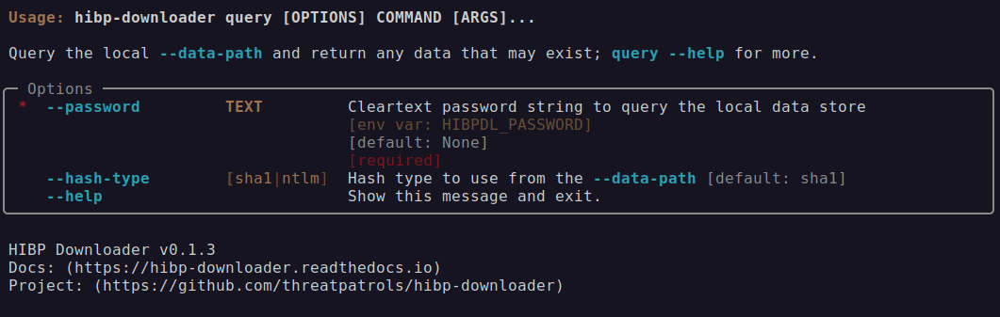

# Query

The ability to directly query plain-text passwords against the in-place `--data-path` makes it possible
to quickly determine if a matching hash is in the dataset without needing to manually compress or try
and store the dataset in a database.

This is achieved by (a) taking a sha1/ntlm hash of the user supplied password (b) using this to determine 
the local compressed content-file this password should exist in if it does exist at all (c) decompress the
hash-prefix content file and seek for the actual hash.

This process is quite efficient in its own right and can support decent-enough queries per second such
that you may not need to implement a database to have a service query this dataset. 

## Usage

CAUTION: by default the CLI will ask the user to input the password (without being shown), it is also possible
to use the `--password` input option to pass this in directly;  If you do this you must understand the potential
for those passwords to be recorded in shell-histories and perhaps other logs. 
