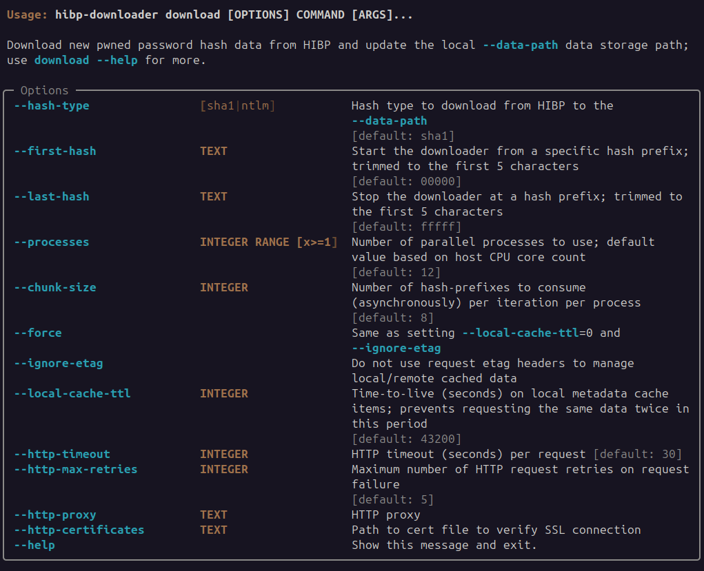

# Download

The `hibp-downloader` CLI tool attempts to be as fast and efficient as Pythonly possible.

The downloader works by creating multiple threads (based on CPU cores) a worker-queue arrangement that each 
invoke async-workers on chunks of the hash-prefix address-space.

The downloader collects the content for each hash-prefix in gzip format which is a deliberate choice over brotli 
compression because CLI tools such as `zcat` and `zgrep` work directly with the stored files and similar brotli-based 
alternatives are not common (or exist?);  This also means we are able to write the received content directly to
disk without any decompression processing.  This saves considerable compute and processing time.

The downloader stores a `.meta` file (JSON, you can also use) alongside each content file that tracks the content
timestamps, checksums and ETAG value; it is possible to use the `--metadata-path` option to store the metadata
separately if required.

Because the downloader tracks content ETAG values we only receive new content from the remote-source (ie 
`api.pwnedpasswords.com`) when the content has actually changed.  The user is able to override this using 
the `--ignore-etag` option that will force all content to be sent by the source without regard for the ETAG.

The downloader also prevents the user from requesting the same hash-prefix content block more than once per 
local-cache-ttl to prevent unnecessary re-requests for the same content in short time periods (default 12 hrs); use 
the `--local-cache-ttl` option to adjust this if needed.

The `--force` option is simply a convenience option that sets both `--ignore-etag` and `--local-cache-ttl=0`  

The options `--hash-type`, `--first-hash`, `--last-hash`, `--processes`, `--chunk-size`, `--http-proxy` and
`--http-certificates` are described in the application-help and should be self-evident how to use.

## Usage


## Logs
The downloader logs emit information about the download progress, not each requested hash-prefix content 
object.  The following attributes are logged -

 * `prefix=` the current hash prefix content downloaded.
 * `source.lc=` count of locally-cached content objects that did not require any request.
 * `source.et` count of etag-match content objects that did not require re-download from source.
 * `source.rc` count of remote-cached content objects that already existed at the edge-cache provider (ie Cloudflare).
 * `source.ro` count of remote-origin content objects that needed to be retrieved from origin.
 * `source.xx` count of content objects that have unknown remote cache status. 

## Example
```commandline
$ hibp-downloader --data-path /opt/storage/hibp-datastore download --first-hash "00000" --last-hash "00fff" --force
2023-11-12T21:23:57+1000 | INFO | hibp-downloader | HIBP Downloader: v0.1.5
2023-11-12T21:23:57+1000 | INFO | hibp-downloader | data-path '/opt/storage/hibp-datastore'
2023-11-12T21:23:57+1000 | INFO | hibp-downloader | metadata-path '/opt/storage/hibp-datastore'
2023-11-12T21:23:57+1000 | INFO | hibp-downloader | Created 12 worker processes to consume a queue of prefix-hash values.
2023-11-12T21:23:59+1000 | INFO | hibp-downloader | prefix=00059 source=[lc:0 et:0 rc:50 ro:0 xx:0] processed=[0.8MB ~17290H/s] api=[40req/s 0.8MB] runtime=0.0min
2023-11-12T21:23:59+1000 | INFO | hibp-downloader | prefix=00077 source=[lc:0 et:0 rc:100 ro:0 xx:0] processed=[1.7MB ~28653H/s] api=[67req/s 1.7MB] runtime=0.0min
2023-11-12T21:24:01+1000 | INFO | hibp-downloader | prefix=0009f source=[lc:0 et:0 rc:150 ro:0 xx:0] processed=[2.5MB ~27690H/s] api=[66req/s 2.5MB] runtime=0.1min
2023-11-12T21:24:01+1000 | INFO | hibp-downloader | prefix=000a9 source=[lc:0 et:0 rc:200 ro:0 xx:0] processed=[3.3MB ~32863H/s] api=[78req/s 3.3MB] runtime=0.1min
2023-11-12T21:24:03+1000 | INFO | hibp-downloader | prefix=000f9 source=[lc:0 et:0 rc:250 ro:0 xx:0] processed=[4.1MB ~32441H/s] api=[77req/s 4.1MB] runtime=0.1min
```