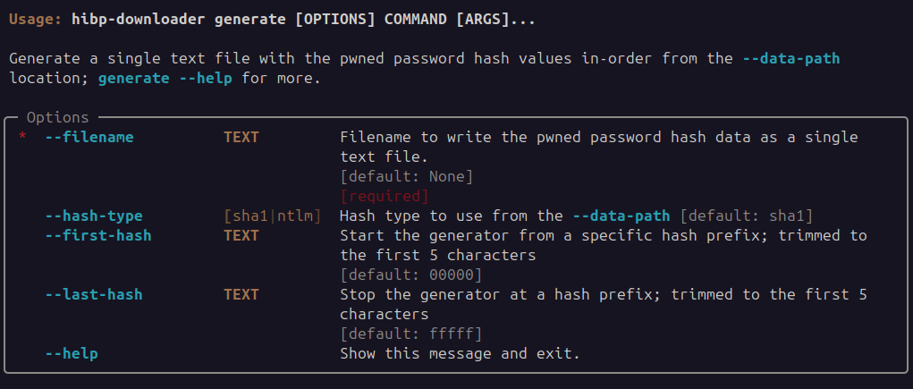

# Generate

Allows the user to generate a single decompressed text file with pwned password hash values in-order that is similar 
to the single-file output [PwnedPasswordsDownloader](https://github.com/HaveIBeenPwned/PwnedPasswordsDownloader) from the HIBP team.

## Usage


## Example
```commandline
$ hibp-downloader --data-path /opt/storage/hibp-datastore generate --filename /tmp/onebigfile.txt
2023-11-12T21:53:31+1000 | INFO | hibp-downloader | HIBP Downloader: v0.1.5
2023-11-12T21:53:31+1000 | INFO | hibp-downloader | data-path '/opt/storage/hibp-datastore'
2023-11-12T21:53:31+1000 | INFO | hibp-downloader | Prefix position '00000' appending to '/tmp/onebigfile.txt'
2023-11-12T21:53:32+1000 | INFO | hibp-downloader | Prefix position '00190' appending to '/tmp/onebigfile.txt'
2023-11-12T21:53:32+1000 | INFO | hibp-downloader | Prefix position '00320' appending to '/tmp/onebigfile.txt'
2023-11-12T21:53:33+1000 | INFO | hibp-downloader | Prefix position '004b0' appending to '/tmp/onebigfile.txt'
```
