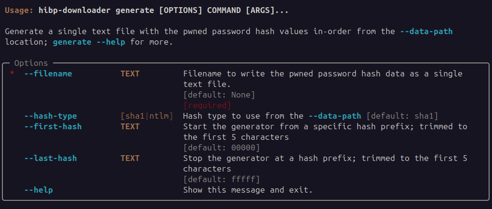

# Generate

!!! warning "Before you use generate — consider using `query` instead"

    If you are generating the full decompressed text file so you can import it into a database for 
    lookups, **you are almost certainly doing it the hard way**.
    
    The [`query`](query.md) command can look up any password directly against the compressed 
    data store — no decompression, no database import, no extra storage required.  It just-in-time 
    decompresses only the single prefix file needed, checks for a match, and returns a result in 
    under a second.  This approach is **faster to set up, dramatically easier to maintain, and uses 
    a fraction of the storage**.
    
    See the [`query` command documentation](query.md) to understand how this works before deciding 
    you need a generated text file.

The `generate` command produces a single decompressed text file containing all pwned password hash 
values in prefix order.  This is similar to the single-file output from
[PwnedPasswordsDownloader](https://github.com/HaveIBeenPwned/PwnedPasswordsDownloader) by the HIBP team.

This is useful when you need a plain-text export for a specific tool or pipeline that requires the
data in this format.  For general-purpose password-checking lookups, the [`query`](query.md)
command is a much better fit.

## Usage


## Example
```commandline
$ hibp-downloader --data-path /opt/storage/hibp-datastore generate --filename /tmp/onebigfile.txt
2023-11-12T21:53:31+1000 | INFO | hibp-downloader | HIBP Downloader: v0.1.5
2023-11-12T21:53:31+1000 | INFO | hibp-downloader | data-path '/opt/storage/hibp-datastore'
2023-11-12T21:53:31+1000 | INFO | hibp-downloader | Prefix position '00000' appending to '/tmp/onebigfile.txt'
2023-11-12T21:53:32+1000 | INFO | hibp-downloader | Prefix position '00190' appending to '/tmp/onebigfile.txt'
2023-11-12T21:53:32+1000 | INFO | hibp-downloader | Prefix position '00320' appending to '/tmp/onebigfile.txt'
2023-11-12T21:53:33+1000 | INFO | hibp-downloader | Prefix position '004b0' appending to '/tmp/onebigfile.txt'
```
