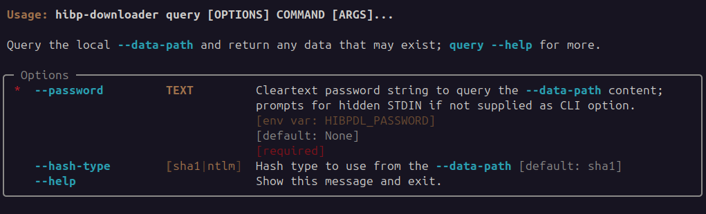

# Query

The ability to directly query plain-text passwords against the in-place `--data-path` makes it possible
to quickly determine if a matching hash is in the dataset without needing to manually compress or try
and store the dataset in a database.

The lookup is fast and efficient.

This is achieved by -

 * taking a sha1/ntlm hash of the user supplied password
 * using this to determine the local compressed content-file this password should exist in if it does exist at all 
 * decompress the hash-prefix content file and seek the actual hash.

This process is quite efficient in its own right and can support decent-enough queries per second such
that you likely do not need to implement a database to have a service query this dataset.  Consider the `--quiet`
option to 

## Usage


CAUTION: by default the CLI will ask the user to input the password (without being shown), it is also possible
to use the `--password` input option to pass this in directly;  If you do this you must understand the potential
for those passwords to be recorded in clear-text in shell-histories and perhaps other logs. 

## Example: with prompt input
```commandline
$ hibp-downloader --data-path /opt/storage/hibp-datastore query
2023-11-12T22:03:23+1000 | INFO | hibp-downloader | HIBP Downloader: v0.1.5
Password:
2023-11-12T22:03:26+1000 | INFO | hibp-downloader | data-path '/opt/storage/hibp-datastore'
{
  "data_path": "/opt/storage/hibp-datastore",
  "hash": "8843D7F92416211DE9EBB963FF4CE28125932878",
  "hash_type": "sha1",
  "hibp_count": 19563,
  "status": "Found"
}
```

## Example: using --password option input
```commandline
$ hibp-downloader --data-path /opt/storage/hibp-datastore query --password foobar
2023-11-12T22:05:38+1000 | INFO | hibp-downloader | HIBP Downloader: v0.1.5
2023-11-12T22:05:38+1000 | INFO | hibp-downloader | data-path '/opt/storage/hibp-datastore'
{
  "data_path": "/opt/storage/hibp-datastore",
  "hash": "8843D7F92416211DE9EBB963FF4CE28125932878",
  "hash_type": "sha1",
  "hibp_count": 19563,
  "status": "Found"
}
```

## Example: query time using --password option
Response time at around 600ms from NFS backed storage location; fast enough to be used directly for services. 
```commandline
$ time hibp-downloader --quiet --data-path /opt/storage/hibp-datastore query --password foobar
{
  "data_path": "/opt/storage/hibp-datastore",
  "hash": "8843D7F92416211DE9EBB963FF4CE28125932878",
  "hash_type": "sha1",
  "hibp_count": 19563,
  "status": "Found"
}

real    0m0.591s
user    0m0.446s
sys     0m0.052s
```
