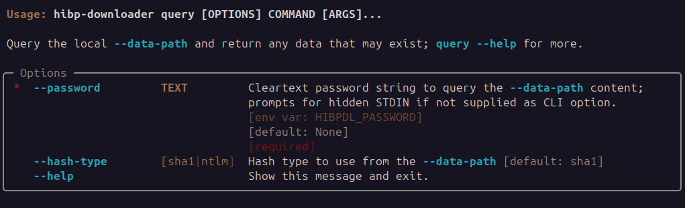

# Query

The `query` command is the **recommended way to check passwords** against your local HIBP data store.

Rather than decompressing the entire dataset and importing it into a database, `query` takes a 
fundamentally smarter approach: it locates the single compressed prefix file where a given 
password hash would live, decompresses just that one file on-the-fly, and checks for a match.
The result is returned in well under a second — even from network-attached storage.

## Why query instead of a database?

| Approach | Storage | Maintenance | Complexity |
|----------|---------|-------------|------------|
| **`query`** (recommended) | ~17 GB compressed | Just re-run `download` periodically | None — works directly on the data store |
| Decompress + database import | ~40+ GB uncompressed + DB overhead | Regenerate, re-import, re-index on every update | Database setup, schema, indexing, import pipeline |

The compressed data store from `download` is all you need.  The `query` command works directly 
against it — no intermediate steps, no database, no extra storage.

!!! tip "Building a password-checking service?"

    The query interface is efficient enough to use directly behind a web service at reasonable
    request loads.  Use the `--quiet` flag to suppress log output and capture only the JSON 
    result.  There is no need to decompress the dataset into a database for a lookup service.

## How it works

 1. Takes a SHA1 or NTLM hash of the supplied password.
 2. Uses the hash prefix to locate the correct compressed data file on disk.
 3. Decompresses that single file in memory and searches for the full hash.
 4. Returns the match status and HIBP occurrence count as JSON.

## Usage


!!! caution

    By default the CLI will prompt for the password without echoing it.  The `--password` option 
    passes the value directly, but be aware that this may record the password in clear-text in 
    shell history and system logs.

## Example: with prompt input
```commandline
$ hibp-downloader --data-path /opt/storage/hibp-datastore query
2023-11-12T22:03:23+1000 | INFO | hibp-downloader | HIBP Downloader: v0.1.5
Password:
2023-11-12T22:03:26+1000 | INFO | hibp-downloader | data-path '/opt/storage/hibp-datastore'
{
  "data_path": "/opt/storage/hibp-datastore",
  "hash": "8843D7F92416211DE9EBB963FF4CE28125932878",
  "hash_type": "sha1",
  "hibp_count": 19563,
  "status": "Found"
}
```

## Example: using --password option input
```commandline
$ hibp-downloader --data-path /opt/storage/hibp-datastore query --password foobar
2023-11-12T22:05:38+1000 | INFO | hibp-downloader | HIBP Downloader: v0.1.5
2023-11-12T22:05:38+1000 | INFO | hibp-downloader | data-path '/opt/storage/hibp-datastore'
{
  "data_path": "/opt/storage/hibp-datastore",
  "hash": "8843D7F92416211DE9EBB963FF4CE28125932878",
  "hash_type": "sha1",
  "hibp_count": 19563,
  "status": "Found"
}
```

## Example: query time using --password option
Response time at around 600ms from NFS-backed storage; fast enough to use directly for services. 
```commandline
$ time hibp-downloader --quiet --data-path /opt/storage/hibp-datastore query --password foobar
{
  "data_path": "/opt/storage/hibp-datastore",
  "hash": "8843D7F92416211DE9EBB963FF4CE28125932878",
  "hash_type": "sha1",
  "hibp_count": 19563,
  "status": "Found"
}

real    0m0.591s
user    0m0.446s
sys     0m0.052s
```
